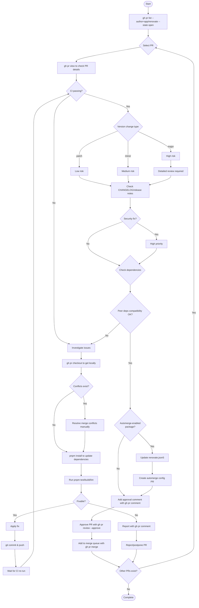

# Review Renovate

Review and merge Renovate PRs following a structured workflow.

## Arguments

$ARGUMENTS

## Workflow

1. **List open Renovate PRs**:
   ```bash
   gh pr list --author=app/renovate --state open
   ```

2. **For each PR, check details**:
   ```bash
   gh pr view <number>
   gh pr checks <number>
   ```

3. **If CI failing**:
   - Checkout: `gh pr checkout <number>`
   - Check conflicts and resolve if needed
   - Run: `pnpm install && pnpm test && pnpm build && pnpm lint`
   - Fix issues and push

4. **Assess version change risk**:
   - **patch**: Low risk - quick review
   - **minor**: Medium risk - check for new features
   - **major**: High risk - detailed review required

5. **Check CHANGELOG/release notes**

6. **Verify peer deps compatibility**

7. **Approve and merge**:
   ```bash
   gh pr review --approve <number>
   gh pr merge <number>
   ```

## Workflow Diagram



## Review Criteria

- **Security updates**: Always HIGH priority
- **Patch updates**: LOW risk - quick review
- **Minor updates**: MEDIUM risk - check for new features
- **Major updates**: HIGH risk - detailed review required
